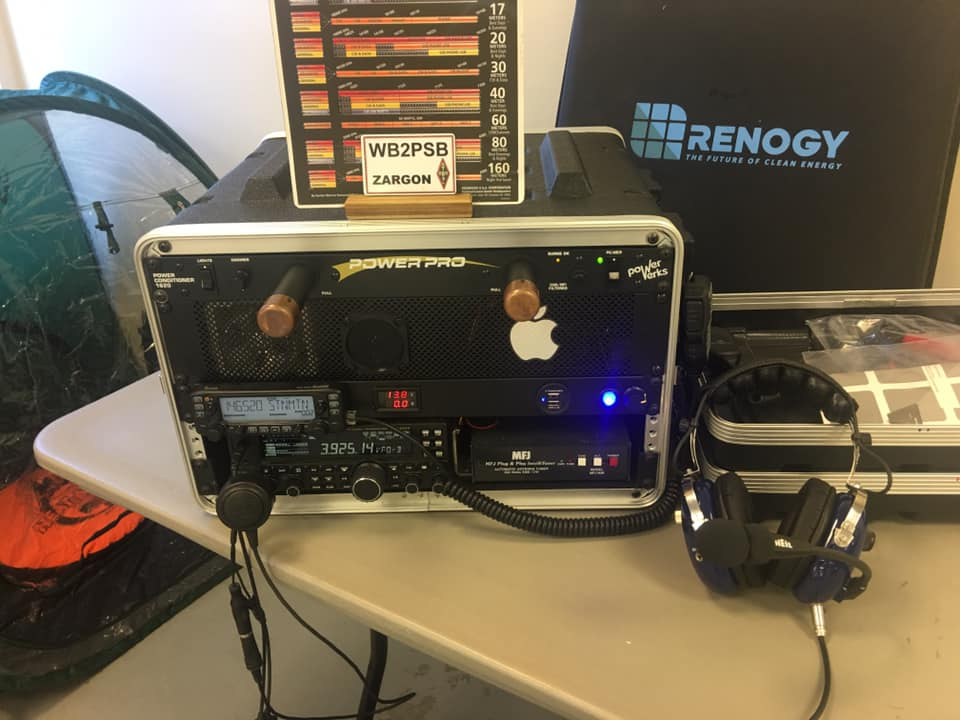
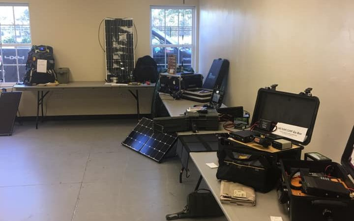

# Contests
## <a name="gobox">Radio Go-Box Contest</a>
The <a href="https://www.totr-radio.org/" alt="TOTR" target="_blank" rel="noopener noreferrer">Alford Memorial Radio Club (AMRC)</a> is proud to sponsor our **Stone Mountain HAMFEST Radio Go-Box Competition**. The concept is to have radio amateurs *show off* their portable base station or Radio Go-Box.  The demonstration will give radio operators ideas to develop, build, and enhance their own Radio Go-Box.

  

A Radio Go-Box is a portable base station consisting of, at a minimum, a transceiver, antenna, and power source.  For the purposes of this contest, the power source does not have to be in the same container as the transceiver.

Cash Prizes will be awarded for winning entries in each of the classes.

  <a href="gobox-signup"><button type="button">Sign Up Now!</button></a>

### Competition Participation
There are a few rules that each participant needs to follow.  All Radio Go-Box entries must have the following present at the station:
* **Container:** The container can be a toolbox, suitcase, tackle box, or ammo can, or a container commercially made specifically for a Radio Go-Box.  However, there are no restrictions. Grouping the equipment into an organized container has a multitude of choices– almost anything goes.   
* **Transceiver:** Any transceiver will be accepted if it transmits on the amateur bands.  The transceiver can be single band, dual band, and/or multi band.  The radio can be a mobile or base station.  It can be from an amateur radio manufacturer or commercial radio manufacturer.
* **Power source:** The power source must be on site with your Radio Go-Box.  It does not have to be on board with the radio.  It can be commercially made or home-brew.  Power source examples include a deep-cycle marine battery, AC to DC power supply, or battery box.  
* **Microphone:** The microphone must be included with your Radio Go-Box.   

### Competition Categories
The contest will be across these categories, not between them.  That is, like-categories will compete and awards will be given in each category group.  The entrant will designate the class they wish to participate/compete in.  The same judging criteria will be applied equally to each contest category.

  

* **Homebrew:** This category is for go kits not utilizing devices commercially made specifically to house or enclose the Go Kit station. These go kits may use toolboxes, tackle boxes, suitcases, ammo cans, or similar to a house or enclose the Go Kit station.
* **HT:** To qualify in this category, the kit must include an external power source for the HT, a deployable antenna that is attached to the radio via a feed line, an external microphone, and a means of securing the HT to a weighted base so that it doesn’t fall off the table during use. This base can be the container itself, or some other option.
### Scoring
Some include the creature comforts while others limit their kits to the necessities of survival. Every setup is unique. Judging for this competition is subjective.  The judges can award up to 10 total points. 

#### The judges will be looking for 
* **Ingenuity** 1-10 points (45% weighting)
* **Functionality** 1-10 points *(35% weighting)*
* **Presentation** 1-10 points *(20% weighting)*

### Security of Entries
Security will be provided during the duration of the HAMFEST for the Radio Go-Box contest entries.

### Contest Rules
**Stone Mountain HAMFEST Radio Go-Box Contest** will be held at 2 pm November 6th, 2021.  You do not have to be a member of any club to participate, but you must be a licensed ham to enter and participate.  There is no entrance fee to enter the contest.

All Radio Go-Box entries must be in working condition at the HAMFEST.  This means you must be able to operate the Radio Go-Box station much like you would at a public service event.  

A good Radio Go-Box should be useful for an emergency or survival situation. These types of projects are open to creativity and individual needs.  The number of radios and antennas can vary from one per kit to even three or more. 

All participants must fill out a submission form located at the Hamfest information table, to be eligible for the judging.  The submission forms will be provided by the Go-Box contest committee, and available at the Hamfest information near the ticket barrel. 

To give an idea of how many entries will be participating, there is a list at the bottom of the page that autopopulates with contest signups.

Radio Go-Boxes will be accepted until 11:00 AM ET on Saturday morning.  This is to provide enough time for viewing and any administrative work required for the submission.

Judging will start on Sunday at 1:00 PM ET with the winning submissions announced at the 2:00 PM ET drawing.

### The following entrants have signed up to participate in the Go-Box contest:

  <iframe src="https://docs.google.com/spreadsheets/d/1af7Yv8mhFExF_fz2Kajp5bL0x53P8jPXv47LJNz_dF8/edit?usp=sharing&amp;rm=minimal" width="300px" height="400px" allowfullscreen="allowfullscreen"></iframe>

