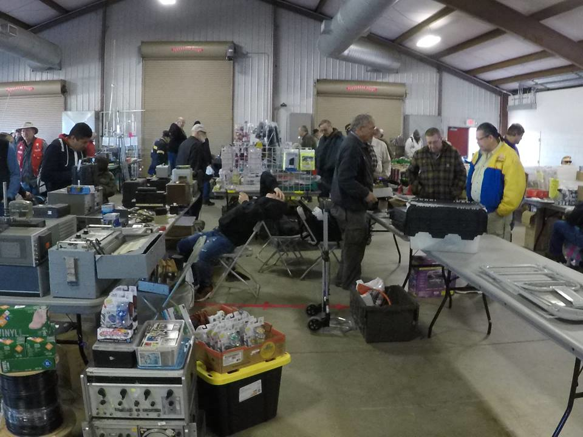

# FLEA MARKET BUILDING
Our flea market is indoors — that’s right, 104 tables inside a building just down from the main exhibition building! [ATM](info#atms) inside.

> *Heat, Air, Electric, Restrooms, Slide up doors for easy loading and setup.*   

      

## Spaces are $25 each *($5 extra if you need electric hookup)* 

### Reserve Your Space Now!
To reserve your space, download the form [General Hamfest Registration 2021](general-hamfest-registration), fill it out, and snail mail it to:
> AMRC Hamfest 2021   
> P.O. Box 1282   
> Stone Mountain, GA 30086

**Note:** All forms must be received by Oct. 27.

  

## Flea Market Layout

  

## Flea Market Set-Up
The Flea Market is open for vendor set-up 12:30 p.m.-9 p.m. on Friday and 6 a.m.-8 a.m. on Saturday. <ins>No one</ins> is allowed to set up in the Flea Market area before 12:30 p.m. on Friday without the approval of the HamFest chairperson.

## RV/Camping
* *Camping Fee $20 per night, per vehicle if you’re in a car, an RV, a van, or tent.  See the [info page](info#camping) for more details.*
