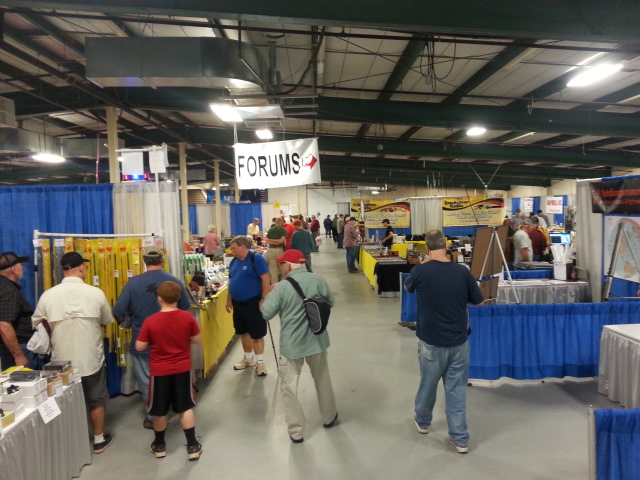

# FORUMS

  

## SCHEDULING

### Saturday Forums __(*)__

|Time    |Location    |Topic                                                                                                          |Presenter                                |
|:------:|:----------:|:-------------------------------------------------------------------------------------------------------------:|:---------------------------------------:|
|09:00 AM|            |ARRL Georgia State Convention Welcome & Message from Southeastern Division Director and Georgia Section Manager|Mickey Baker N4MB                        |
|10:00 AM|            |                                                                                                               |                                         |
|11:00 AM|            |                                                                                                               |                                         |
|12:00 PM|            |                                                                                                               |                                         |
|13:00 PM|            |                                                                                                               |                                         |
|14:00 PM|            |                                                                                                               |                                         |

__(*)__ _Some of these schedules will be changed and updated in the coming days. Thank you for your patience._

### Sunday Forums __(*)__

|Time    |Location                     |Topic                                                                                                                      |Presenter           |
|:------:|:---------------------------:|:-------------------------------------------------------------------------------------------------------------------------:|:------------------:|
|09:00 AM|                             |                                                                                                                           |                    |
|10:00 AM|                             |                                                                                                                           |                    |
|11:00 AM|                             |                                                                                                                           |                    |
|12:00 PM|Prize Area.                  |Personal Go-Kit For Emergency Communications Contest You can read more about the [Go-box contest here](contests#go-box).|Mickey Baker N4MB   |
| ------ |                             |Go Kit Contest Finals Announced                                                                                            |                    |

__(*)__ _Some of these schedules will be changed and updated in the coming days. Thank you for your patience._

## Ongoing Activities (Saturday and Sunday) (In the area directly in front of the Main Exhibit Hall)

> * **GEORGIA ARES SKILLS WORKSHOP:** Presented by Georgia ARES members
> * **AMSAT:** Presented by Dr. John Kludt/K4SQC and Daryl Young K4RGK while using the NFARL mobile tower
> * **The Stone Mountain HamFest AMSAT Challenge**
> * **Gwinnett ARES Trailer Mobile Communications Center (and Talk-in for HamFest)**
