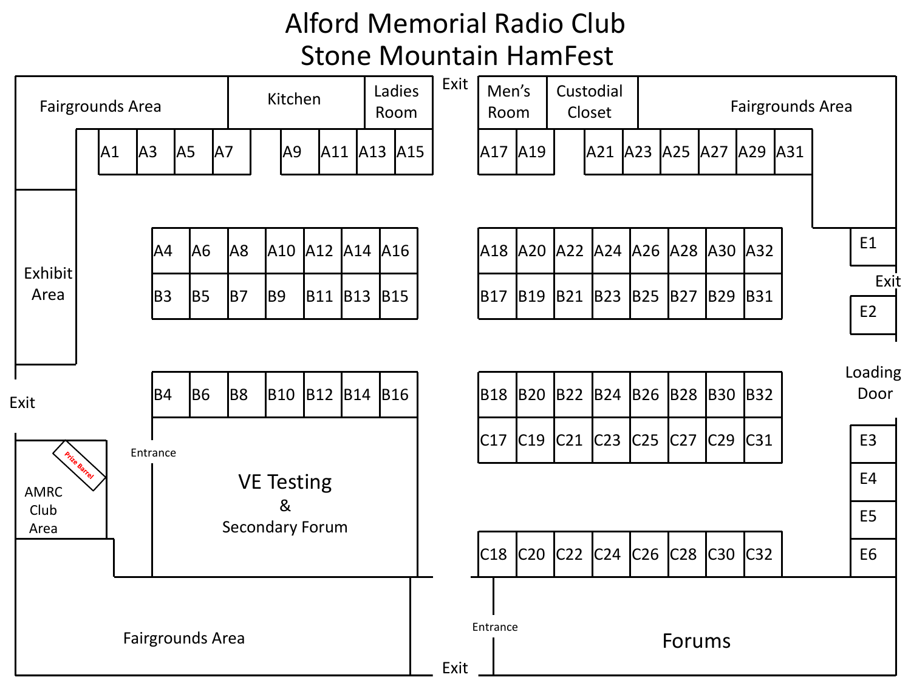

# EVENT INFO

## WHERE:
> <a href="https://goo.gl/maps/eWLxcWAxbfJwnZFD7" target="_blank" rel="noopener noreferer">Gwinnett County Fairgrounds</a>   
> <a href="https://www.google.com/maps/dir/33.7545584,-84.3079934/Gwinnett+County+Fairgrounds,+2405+Sugarloaf+Pkwy,+Lawrenceville,+GA+30045/@33.8592946,-84.2894948,11z/data=!3m1!4b1!4m17!1m6!3m5!1s0x0:0x7294ea8a286b2789!2sGwinnett+County+Fairgrounds!8m2!3d33.91955!4d-83.987572!4m9!1m1!4e1!1m5!1m1!1s0x88f5b9332dcdbf0f:0x7294ea8a286b2789!2m2!1d-83.987572!2d33.91955!3e0" target="_blank" rel="noopener noreferer">2405 Sugarloaf Parkway</a>   
> <a href="https://www.google.com/maps/dir/33.7545584,-84.3079934/Gwinnett+County+Fairgrounds,+2405+Sugarloaf+Pkwy,+Lawrenceville,+GA+30045/@33.8592946,-84.2894948,11z/data=!3m1!4b1!4m17!1m6!3m5!1s0x0:0x7294ea8a286b2789!2sGwinnett+County+Fairgrounds!8m2!3d33.91955!4d-83.987572!4m9!1m1!4e1!1m5!1m1!1s0x88f5b9332dcdbf0f:0x7294ea8a286b2789!2m2!1d-83.987572!2d33.91955!3e0" target="_blank" rel="noopener noreferer">Lawrenceville, GA 30045</a>

## WHEN:
> Nov. 6-7, 2021   
> Sat: 8 a.m. - 4 p.m.   
> Sun: 8 a.m. - 2 p.m.   

## LODGING:
### HOTEL:
#### Special Pricing at Hampton Inn in Snellville, Ga.
For this event, the 2021 Stone Mountain Hamfest is proud to partner with Hampton Inn of Snellville, Ga.  The Hampton Inn is located just 10 mins away from the Gwinnett County Fairgrounds.

   

**Please** <a class="bold" href="tel:+16783449090">call</a> **or** <a class="bold" title="Book Now" href="https://secure3.hilton.com/en_US/hp/reservation/book.htm?inputModule=HOTEL&ctyhocn=ATLSVHX&spec_plan=CHHHAM&arrival=20191101&departure=20191103&cid=OM,WW,HILTONLINK,EN,DirectLink&fromId=HILTONLINKDIRECT" target="_blank" rel="noopener noreferrer">book online</a> **at the Hampton Inn Snellville, Ga. They will have rooms available.** 
> <a href="https://www.google.com/maps/dir/33.7545584,-84.3079934/1905+Pharrs+Rd,+Snellville,+GA+30078/@33.8194588,-84.3010348,11z/data=!3m1!4b1!4m18!1m7!3m6!1s0x88f5b97bd613f823:0xcdd5c154d6b792ba!2s1905+Pharrs+Rd,+Snellville,+GA+30078!3b1!8m2!3d33.8798335!4d-84.0091821!4m9!1m1!4e1!1m5!1m1!1s0x88f5b97bd613f823:0xcdd5c154d6b792ba!2m2!1d-84.0091821!2d33.8798335!3e0" target="_blank" rel="noopener noreferer">1905 Pharrs Road</a>   
> <a href="https://www.google.com/maps/dir/33.7545584,-84.3079934/1905+Pharrs+Rd,+Snellville,+GA+30078/@33.8194588,-84.3010348,11z/data=!3m1!4b1!4m18!1m7!3m6!1s0x88f5b97bd613f823:0xcdd5c154d6b792ba!2s1905+Pharrs+Rd,+Snellville,+GA+30078!3b1!8m2!3d33.8798335!4d-84.0091821!4m9!1m1!4e1!1m5!1m1!1s0x88f5b97bd613f823:0xcdd5c154d6b792ba!2m2!1d-84.0091821!2d33.8798335!3e0" target="_blank" rel="noopener noreferer">Snellville, GA 30078</a>   
>  <a class="bold" href="tel:+16783449090">678-344-9090</a>

<a class="bold" title="Book Now" href="https://secure3.hilton.com/en_US/hp/reservation/book.htm?inputModule=HOTEL&ctyhocn=ATLSVHX&spec_plan=CHHHAM&arrival=20191101&departure=20191103&cid=OM,WW,HILTONLINK,EN,DirectLink&fromId=HILTONLINKDIRECT" target="_blank" rel="noopener noreferrer">BOOK ONLINE NOW!</a>

### <a name="camping">CAMPING (ON SITE):</a>
RV, travel trailer, popup, and even regular tent sites are available at the Stone Mountain Hamfest. The restroom building is open 24-hours during the HamFest.  Any vehicle with people sleeping must have its "**HamFest Camping Sign**" visible at all times.  The cost for staying overnight is $20.00 per night (**ONLY** in your car, truck, or RV). Please make sure to indicate on the [registration form](general-hamfest-registration) if you are camping.

Each campsite has 50 amp shore-power and a water spigot.  There are 45 *back-in* RV spaces. The spaces are gravel mixed with some pavement and a hard grassy surface. Each campsite is wide enough to extend your RV awning. 

*This isn’t a campground like a state park.* 

## <a name="atms">ATM MACHINES:</a>
ATM machines are in the main exhibit hall and flea market buildings. Each ATM transaction will have a service charge. Stone Mountain Hamfest nor Gwinnett County Fairgrounds have any connection and are not responsible in any way for monetary loss or breach of personal information no banking information visitors or vendors using the ATM machines. Provided by <a title="National ATM" href="https://www.atmmachines.com" target="_blank" rel="noopener noreferrer">National ATM (atmmachines.com)</a>.  National ATM is solely responsible for your transaction

## FOOD:
We will have several onsite food vendors and food trucks available on both Sat and Sunday for breakfast and lunch.

## <a name="exhibit_hall_map">EXHIBITION HALL MAP</a>

  

