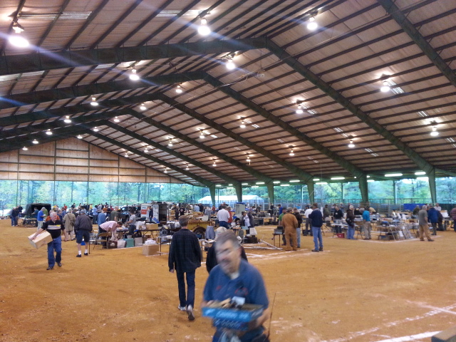

# Tailgating
## Boneyard Tailgating
If you can’t find what you want in the exhibit hall or flea market, then check out the boneyard/tailgate area for unbelievable bargains on perfectly good equipment and perfectly good junk!   

  

If you have a couple of things to unload yourself, park and display them in one of the more than 300 spaces in the boneyard (and there is not a bad spot on the lot). Purchase a [boneyard space](tickets#boneyard) on the [tickets page](tickets) before time runs out!
## Commercial Tailgating
Commercial tailgaters can now reserve in advance a larger space with 50 amp electrical connections for their large tents, trailers, or motor homes that are part of their displays. <ins>This is the only reserved tailgating allowed</ins>. These spaces are in a prime location, near food vendors, and between the fleamarket building and the tailgating area. Sites are limited so reserve them early!

Each space is 10 feet wide so you may need several spaces if you’re in an RV or camper. All spaces are on the road from the main entrance to the main exhibit hall.

## Commercial Tailgate Set-Up
Commercial Tailgating Vendors can set up in the commercial tailgating area 12:30 p.m.-9 p.m. Friday and 6-8 a.m. Saturday.

**NOTE:** No one is allowed to set up in their commercial tailgating space before 12:30 p.m. on Friday without the approval of the Hamfest Chairman.
