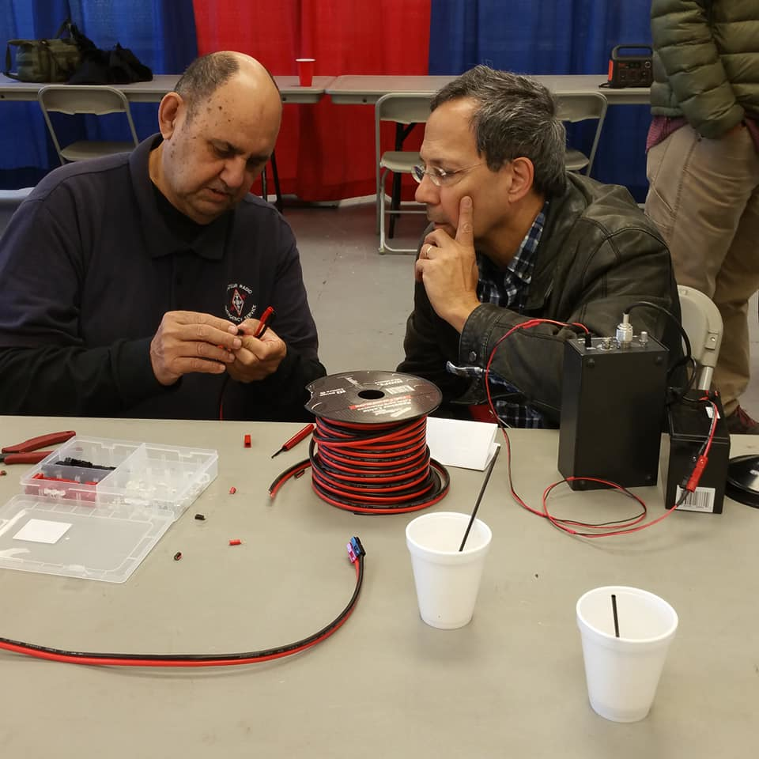
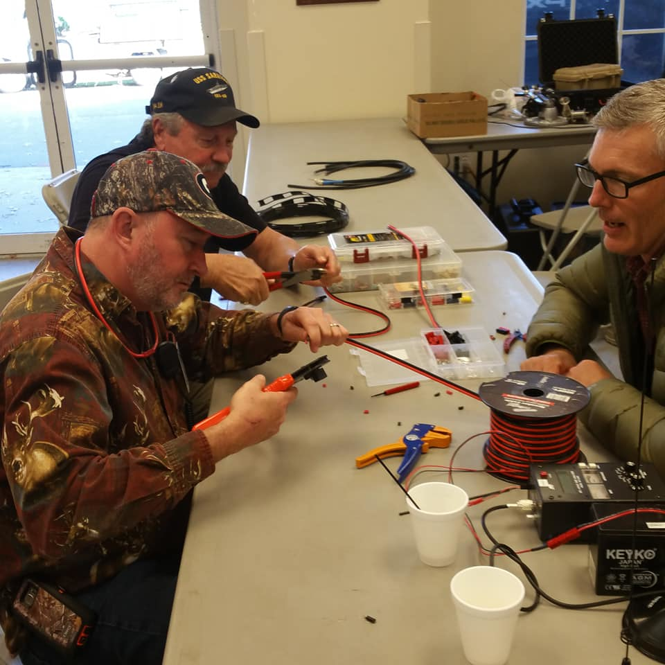
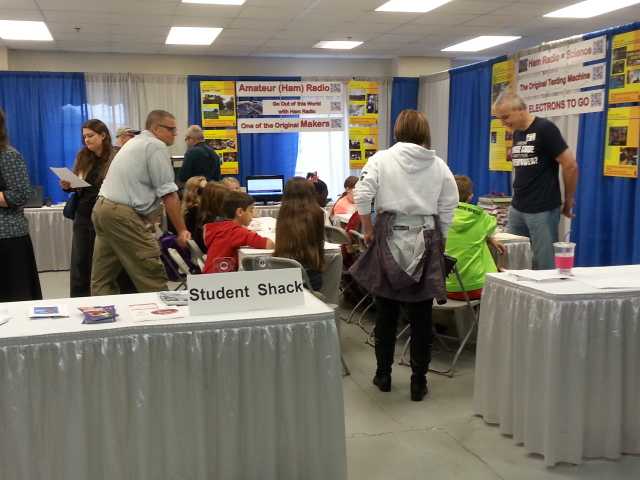
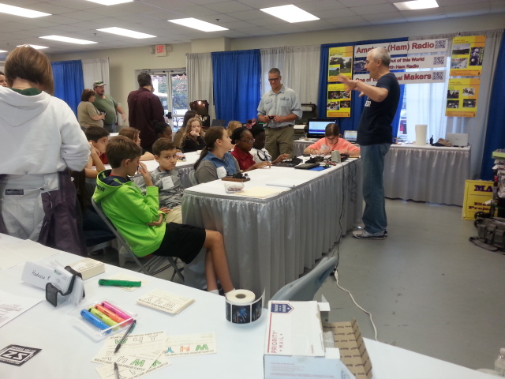

# WORKSHOPS

## Georgia ARES Skills Workshop
Georgia ARES will be conducting Skills Training on:
* Saturday - From 10:00 AM ET until 2:00 PM ET
* Sunday - From 10:00 AM ET until 1:00 PM ET

### This is a _Hands-On_ workshop!
**Materials Will Be Provided:**
* Coax
* Coax Connectors
* Terminals
* Power Poles
* Meters
* Antenna Analyzers
* Antennas
* Wire
* Ladder Line
* _(and tools)_

#### Curriculum (may be edited up to the event by Georgia ARES):  
* **Soldering:** about how to install connectors, repair wires, and attach coax   
* **Crimping Tools:** about Power Poles and electrical terminals   
* **Meters:** about multimeters (analog and digital) (volt, ohm and amp)   
* **Analyzers:** about antenna analyzers, noise bridges, RX bridges, SWR analyzers, and/or RF analyzers
  

  
  

## Youth

### STUDENT SHACK
As all of us are aware: getting young children, who will all too soon be replacing many of us, interested in amateur radio needs to be a high priority.  To this end, the Stone Mountain Hamfest has, for years, brought a youth slant to our HamFest.  In fact, we may have been the birthplace of the movement to get youth involved.

With the increased emphasis on STEM in the schools, we’re more involved than ever. STEM is the driving force behind our STUDENT SHACK 2021 Stone Mountain Hamfest.

  
  

